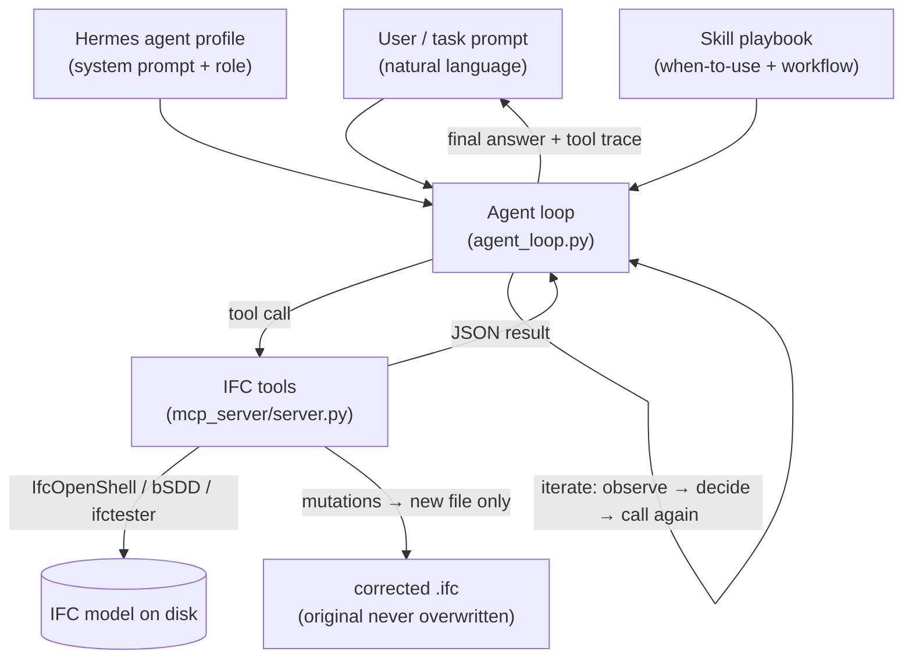

# IFC Intelligence Agent — Agentic PoC

**LLM agents that read, check, and correct IFC building models to make them digital-twin-ready — using tool-use over [IfcOpenShell](https://ifcopenshell.org/).**

This repository is a **focused proof-of-concept** extracted from a larger internal tool. It contains only the *agentic layer* — the agent loop, the specialist agent profiles, the skills, and the IfcOpenShell "tool" library they drive — plus the PoC we ran and its tests. The web GUI, 3D viewer, client models, and all secrets have been removed.

It exists to show the AI/ML team, in a small readable codebase, how **agents + skills + tool-use** come together on a real domain problem (openBIM / IFC correction), and how the same pattern can be reproduced with an off-the-shelf agent harness such as **Claude Code**.

> **Where this fits:** this is an early building block of a planned **digital-twin platform**. The platform's job is to take messy authored IFC and drive it through automated + human-approved workflows until it is *correct, classified, COBie-complete, and digital-twin ready*. This PoC demonstrates the automation core of that workflow.

---

## What problem it solves

IFC files exported from authoring tools (Revit, ArchiCAD, …) are routinely "dirty" for downstream use:

- generic **`IfcBuildingElementProxy`** blobs instead of real classes (`IfcColumn`, `IfcSlab`, …)
- **orphan** elements not contained in any space/storey
- **duplicate GlobalIds** that break federation
- **missing type assignments** and **missing COBie/FM data** (Manufacturer, Model, …)
- no **classification** (Uniclass / OmniClass / bSDD) references

An LLM agent is given a **toolbox of deterministic IfcOpenShell operations** and asked to diagnose these issues, propose fixes, apply them **non-destructively** (always to a new file), and verify its own work — exactly how a BIM coordinator would, but automated and auditable.

---

## The agentic pattern in one picture



The loop is a standard **plan → call tool → observe result → decide → repeat → answer** cycle (OpenAI-style function calling). What makes it useful is the **tool library**: every tool is a real, tested IfcOpenShell operation, so the model reasons but never hand-edits IFC text.

See **[docs/ARCHITECTURE.md](docs/ARCHITECTURE.md)** for the full breakdown.

---

## What's in this bundle

```
src/ifc_agent/
├── agent_loop.py         ★ the agentic tool-use loop (start here)
├── hermes_profiles.py    ★ 6 specialist agent personas
├── skill_registry.py       load/parse the markdown skills
├── config.py               LLM provider auto-detection (Anthropic/OpenRouter/Groq)
├── mcp_server/server.py  ★ 24 IFC tools exposed via FastMCP (the "tool use for IfcOpenShell")
├── checker/                6 read-only quality checks (schema/ids/spatial/guid/proxy/type)
├── classification/         proxy → real IFC class (LLM + bSDD + safe mutation)
├── enrichment/             COBie/FM data extraction + injection
├── bep_parser/             BIM Execution Plan (PDF/DOCX) → YAML rules → IDS
├── anonymiser/             strip PII before anything leaves the machine
├── evidence_pack.py        bounded, clustered evidence for grounded reasoning
├── validation_store.py     SQLite store of models / runs / normalized issues
└── issue_normalizer.py     unify all check output into one issue shape
skills/                    9 BIM workflow playbooks (markdown)
rules/                     baseline + COBie IDS specs
poc/                       the demonstration scripts we ran
tests/                     unit + integration tests (synthetic fixtures only)
docs/                      architecture, agents/skills, PoC results, reproduce-with-Claude-Code
```

★ = the files to read first if you're here to learn the agentic pattern.

---

## Quick start

```bash
python -m venv .venv && source .venv/bin/activate    # Windows: .venv\Scripts\activate
pip install -e ".[dev]"

# 1. Run the tests (no API key or IFC file needed — fixtures are synthetic)
pytest

# 2. Run a deterministic (no-LLM) correction on the sample model
python poc/reclassify_proxies_poc.py tests/test_data/demo_model.ifc

# 3. Run the agentic loop (needs an LLM key)
cp .env.example .env         # add ANTHROPIC_API_KEY, OPENROUTER_API_KEY, or GROQ_API_KEY
python poc/run_agent_poc.py tests/test_data/demo_model.ifc

# 4. Start the MCP tool server (for Claude Code / other agents)
ifc-agent serve              # FastMCP on http://127.0.0.1:8000/mcp
```

---

## Documentation

| Doc | What it covers |
|-----|----------------|
| **[docs/ARCHITECTURE.md](docs/ARCHITECTURE.md)** | The agent loop, tool-use over IfcOpenShell, the 24-tool catalog, evidence grounding, non-destructive mutation. |
| **[docs/AGENTS_AND_SKILLS.md](docs/AGENTS_AND_SKILLS.md)** | The 6 Hermes agent profiles and 9 skill playbooks, and how a skill turns into tool calls. |
| **[docs/POC_AND_TESTS.md](docs/POC_AND_TESTS.md)** | The proxy-reclassification PoC we ran (agentic vs deterministic) and the test suite. |
| **[docs/REPRODUCE_WITH_CLAUDE_CODE.md](docs/REPRODUCE_WITH_CLAUDE_CODE.md)** | Reproduce the whole thing with Claude Code (MCP + skills) or the Claude Agent SDK. |

---

## Safety & data handling

- **No secrets** in this repo. LLM keys live only in a local `.env` (git-ignored).
- **No client/company models.** Only small **synthetic** IFC fixtures (`tests/test_data/demo_*.ifc`) are included; the real PoC ran on internal models that are *not* shipped.
- **Non-destructive by design.** Every mutation writes a new file; originals are never overwritten. IFC-changing actions are gated behind human approval in the full platform.
- **Privacy-by-design.** `anonymiser/strip.py` removes GPS, person/org names, and addresses before any cloud/LLM call.

_Status: proof-of-concept. Not production-hardened. See the parent tool for the GUI, 3D viewer, and approval workflow._
