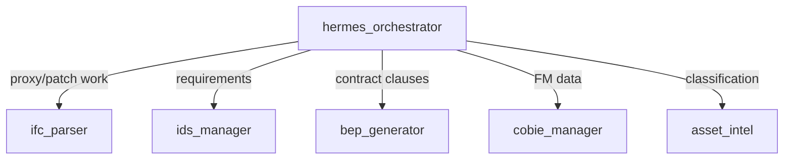

# Agents & Skills

Two ideas the AI/ML team should take away from this PoC:

1. **Agents** = personas. A profile is just a structured system-prompt fragment (role, mission, focus, allowed actions) that biases the *same* loop toward one job.
2. **Skills** = playbooks. A skill is a markdown file that tells the agent *when* to act and *which tools to call in what order* — portable prompt engineering, versioned as files.

Neither is code the model can't see: both are plain text injected into the prompt. That is the whole trick.

---

## Agents — the Hermes profiles (`hermes_profiles.py`)

Six profiles, each a dict with `role`, `mission`, `specialist_focus`, `allowed_actions`, `handoff_targets`, and a `primary_skill`. They are resolved by `get_hermes_profile(name)` (with aliases via `normalize_hermes_agent`).

| Profile | Role | Focus | Primary skill |
|---------|------|-------|---------------|
| **hermes_orchestrator** | Planner / router | Interpret the request, sequence specialists, keep approval gates | `bim-team-review` |
| **ifc_parser** | Model QA | Schema, spatial, GUID, proxy, type, psets; apply patches | `ifc-patch` |
| **ids_manager** | Requirements / validation | Author IDS, validate, trace gaps to elements | `ids-workflow` |
| **bep_generator** | ISO 19650 / BEP | Draft BEP/EIR clauses, BEP→IDS pipeline | `ids-workflow` |
| **cobie_manager** | COBie / FM handover | Field completeness, safe enrichment | `cobie-complete` |
| **asset_intel** | Asset / lifecycle | bSDD classification, CMMS readiness | `bsdd-classify` |

A profile changes the system prompt only — same tools, same loop. `build_bim_team_system_prompt(profile, mode)` stitches the base BIM instructions + the profile's role/mission/allowed-actions + a mode nudge.



This is a lightweight **orchestrator → specialists** multi-agent shape. In this PoC the routing is expressed via profiles + `handoff_targets`; the loop itself runs one profile at a time.

---

## Skills — the playbooks (`skills/*.md`, `skill_registry.py`)

Nine skills, each a markdown file with a fixed structure: **title → description → "When to use" → "Tools needed" → "Workflow" (numbered steps) → report format.**

| Skill | Purpose |
|-------|---------|
| `ifc-baseline-check` | 6-module quality check (schema/IDS/spatial/GUID/proxy/type) |
| `ifc-diff` | Compare two IFC versions (added/deleted/modified/moved) |
| `ifc-patch` | Apply corrections (fix GUIDs, reclassify, add psets, assign container) |
| `proxy-reclassify` | Identify & reclassify `IfcBuildingElementProxy` |
| `bsdd-classify` | Look up correct Uniclass/OmniClass codes via bSDD |
| `ids-workflow` | Author, validate, and manage IDS specs |
| `cobie-complete` | FM-handover readiness + COBie enrichment |
| `bim-team-review` | Full project review + correction plan |
| `skill-creator` | Create/modify skills (self-extension) |

`skill_registry.py` parses these files (`list_skills`, `get_skill`, `create_skill`, `update_skill`, `delete_skill`) — extracting title, description, the "When to use" section, and the backtick-wrapped tool names mentioned. Because skills are just files, the agent can author new ones at runtime (`skill-creator`), which is a simple form of self-improvement.

---

## How a skill becomes tool calls

Take `proxy-reclassify`. The workflow section reads (paraphrased): *load the model → get_proxies → for each identifiable group pick the right IFC class (cross-check bSDD) → reclassify_element → re-run the proxy check → report*.

When the agent runs with that skill in its prompt, the loop produces roughly:

```
load_model(file_path)                              # orient
get_proxies(file_path)                             # 48 proxies, 19 groups
bsdd_search_classes("steel post")                  # confirm IfcColumn is right
reclassify_element(file_path, gid1, "IfcColumn")   # apply (writes new file)
reclassify_element(out,       gid2, "IfcSlab")     # chain on the output
...
run_specific_check(out, "proxy")                   # verify count dropped
→ "Reclassified 12 elements across 5 groups; proxies 48 → 36; output: ...corrected.ifc"
```

The skill is the *procedure*; the profile is the *persona*; the tools are the *hands*. Swap the skill and the same agent does a COBie sweep or an IDS validation instead.

See it end-to-end in **[POC_AND_TESTS.md](POC_AND_TESTS.md)**.
