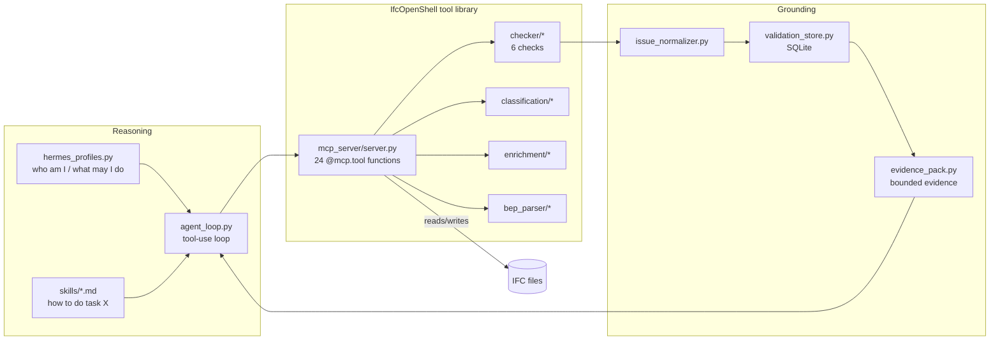
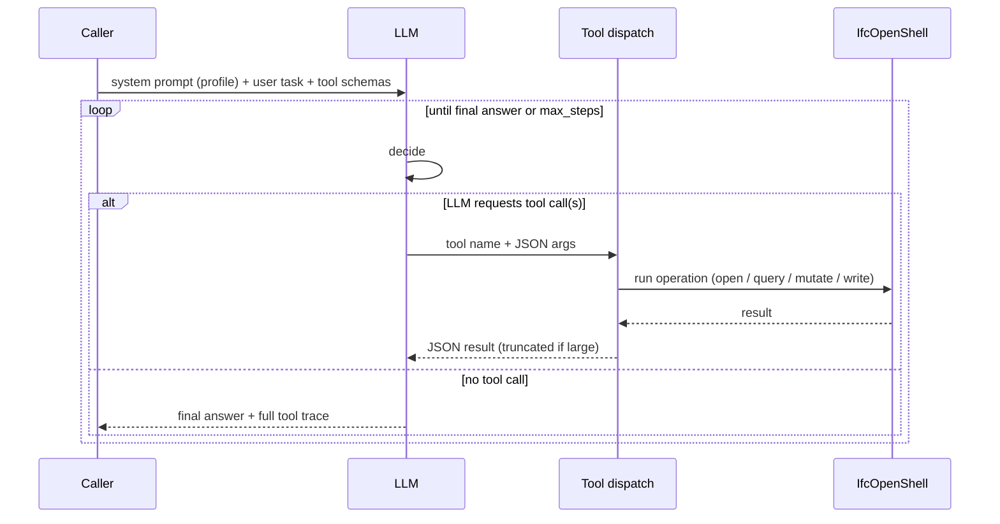

# Architecture

How the agent, the skills, and the IfcOpenShell tools work together to correct IFC.

---

## 1. The layers



- **Reasoning** decides *what* to do. It is model-agnostic (any OpenAI-compatible LLM).
- **Tools** are deterministic, tested IfcOpenShell operations. The LLM never edits IFC text; it calls tools.
- **Grounding** keeps the LLM honest: checks produce normalized issues in SQLite, and an *evidence pack* feeds the model a bounded, representative slice instead of an unbounded dump.

---

## 2. The agent loop (`agent_loop.py`)

`run_agent_loop(prompt, system_prompt, file_path, hermes_profile, max_steps)` implements a textbook multi-turn tool-use loop:



Key implementation details worth noting for the AI/ML team:

| Concern | How it's handled |
|--------|------------------|
| **Tool schemas** | `TOOL_DEFINITIONS` — 24 OpenAI function-calling specs (name, description, JSON-schema params). |
| **Dispatch** | `_dispatch_tool()` looks the tool up **by name** on the MCP server module and calls the underlying Python function directly — *no HTTP round-trip, no running server needed*. |
| **Context control** | results > 8 KB are recursively truncated (`_truncate_tool_result`, lists capped at 20 items) so long models don't blow the context window. |
| **Robustness** | falls back to a no-tools completion if a provider rejects `tool_choice="auto"`; forces a summary if `max_steps` is hit. |
| **Observability** | returns a `tool_calls` trace (step, tool, args, elapsed, result preview) alongside the final answer — this is what the PoC prints. |
| **Provider** | `_build_client()` builds an OpenAI-compatible client from `config` (Groq / OpenRouter / Anthropic), auto-selecting whichever API key is present. |

The **system prompt** is assembled by `build_bim_team_system_prompt(profile, mode)` — a base "you are a BIM agent, query first then patch then verify" instruction, plus the selected profile's role/mission/allowed-actions, plus a mode nudge (`check` / `classify` / `enrich` / `diff` / `patch` / `ids`).

---

## 3. Tool use over IfcOpenShell (`mcp_server/server.py`)

The 24 tools are the heart of the PoC — they are what "tool use for IfcOpenShell" means concretely. They are registered with **[FastMCP](https://gofastmcp.com)** (`@mcp.tool()`), so the *same* functions serve two consumers:

1. the project's own agent loop (called directly in-process), and
2. any external MCP client — e.g. **Claude Code** — over `ifc-agent serve` (streamable-HTTP at `/mcp`).

A small **LRU cache** (`_get_model`, size `IFC_AGENT_MCP_MODEL_CACHE_SIZE`) avoids re-parsing the same IFC on every call.

### Tool catalog

| Group | Tools | Backed by |
|-------|-------|-----------|
| **Query** | `load_model`, `get_entities`, `get_entity_properties`, `get_spatial_tree`, `get_entities_in_spatial`, `search_elements`, `get_safe_metadata` | IfcOpenShell (`by_type`, `util.element.get_psets/get_type/get_container`) |
| **Check** | `run_baseline_check`, `run_specific_check`, `get_proxies`, `get_orphan_elements` | `checker/` modules |
| **Diff** | `diff_ifc_files`, `diff_element_properties` | GlobalId indexing + pset comparison |
| **Patch / mutate** | `fix_guid_duplicates`, `reclassify_element`, `add_or_update_pset`, `assign_to_spatial_container`, `add_classification_reference`, `apply_patch_set` | `ifcopenshell.api` (`root.reassign_class`, `pset.*`, `spatial.*`) |
| **bSDD** | `bsdd_search_classes`, `bsdd_get_class`, `bsdd_list_dictionaries`, `bsdd_validate_element_classification` | live HTTP to `api.bsdd.buildingsmart.org` |
| **IDS** | `list_ids_specs`, `validate_ids_spec`, `create_ids_from_model` | `ifctester` |
| **BEP** | `extract_bep_rules`, `compile_bep_yaml_to_ids` | PyMuPDF/python-docx + LLM + `ifctester` |
| **Classify / COBie** | `auto_classify_proxies`, `enrich_cobie_data` | LLM + IfcOpenShell mutation |

### Non-destructive mutation

Every patch/mutation tool **opens the source, mutates in memory, and writes a *new* file** (suffixes like `_reclassified.ifc`, `_guid_fixed.ifc`, `_enriched.ifc`). The original is never touched. The canonical safe reassignment uses:

```python
ifcopenshell.api.run("root.reassign_class", model, product=element, ifc_class="IfcColumn")
```

which preserves the element's GlobalId, properties, placement, and relationships while changing its class.

---

## 4. The correction sub-engines

The tools delegate to four small, independently-testable engines:

- **`checker/`** — six read-only checks (`schema`, `ids`, `spatial`, `guid`, `proxy`, `type`), each a dataclass with `.passed` / `.summary` / `.to_dict()`. `runner.run_all()` orchestrates them and aggregates a `CheckerReport`.
- **`classification/`** — `proxy_extractor` pulls proxy metadata → `bsdd_resolver.infer_class()` asks the LLM for the correct IFC class → `mutator.classify_and_mutate()` applies `root.reassign_class` safely.
- **`enrichment/`** — `harvester` finds FM elements missing Manufacturer/Model → `ai_mapper` extracts COBie fields **strictly from existing text** (explicit anti-hallucination prompt) → `injector` writes them into `Pset_ManufacturerTypeInformation`.
- **`bep_parser/`** — ingests a BIM Execution Plan (PDF/DOCX) → LLM turns prose requirements into YAML rules → `compiler` emits a buildingSMART **IDS** file the checker can validate against.

---

## 5. Grounding: keeping the LLM honest

The agent doesn't guess from raw model dumps. Instead:

1. `checker.runner.run_all()` produces results →
2. `issue_normalizer.normalize_checker_report()` flattens every finding into one shape (`rule_id`, `severity`, `global_id`, `suggested_fix`, `auto_fixable`, `approval_required`) →
3. `validation_store` (SQLite: `models`, `elements`, `validation_runs`, `issues`) persists them →
4. `evidence_pack.build_agent_evidence_pack()` builds a **bounded (~24 KB), clustered** evidence object — cluster summaries + a few representative elements per cluster, plus category/severity totals and IDS/COBie/proxy summaries.

This is a reusable pattern: **don't hand the model everything — hand it a clustered, size-capped, cited slice, and let it request more via tools.**

---

## 6. Configuration (`config.py`)

- Provider auto-detected from whichever key is present: **`ANTHROPIC_API_KEY` > `OPENROUTER_API_KEY` > `GROQ_API_KEY`**.
- Per-provider defaults (e.g. Groq `llama-3.3-70b-versatile`, Anthropic `claude-sonnet-4-6`); override with `IFC_AGENT_LLM_PROVIDER` / `IFC_AGENT_LLM_MODEL`.
- `IFC_AGENT_MAX_STEPS` bounds tool-call iterations; `IFC_AGENT_MCP_MODEL_CACHE_SIZE` bounds the parsed-model cache.

> **Note (model IDs):** the default model IDs in `config.py` reflect the versions available when the PoC was built. When you reproduce this, set `IFC_AGENT_LLM_MODEL` to a current model for your chosen provider.
